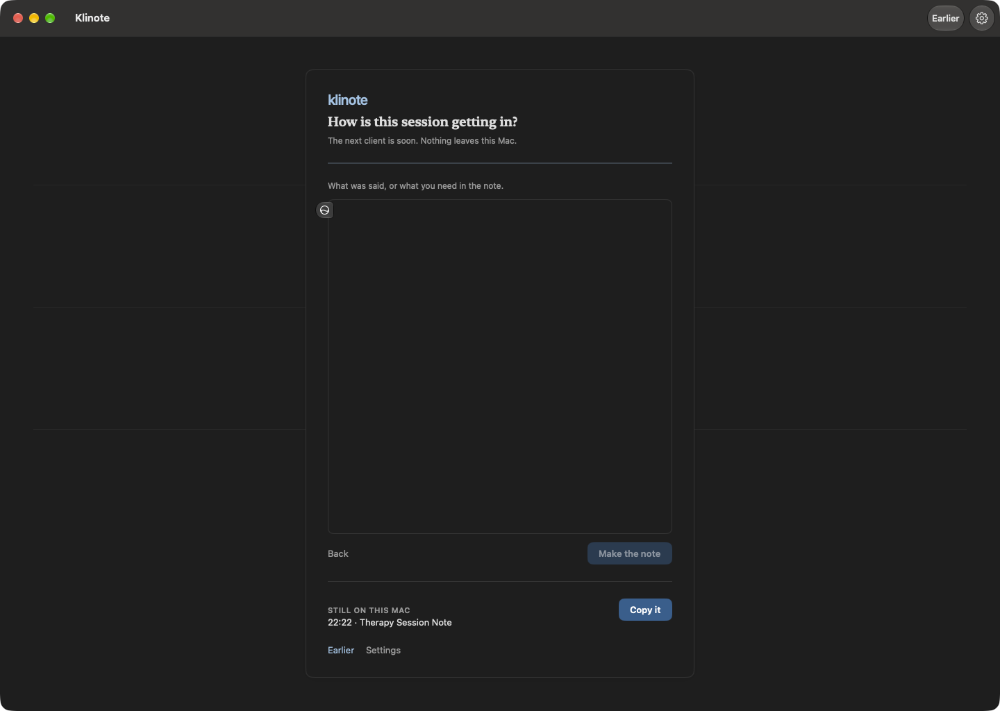
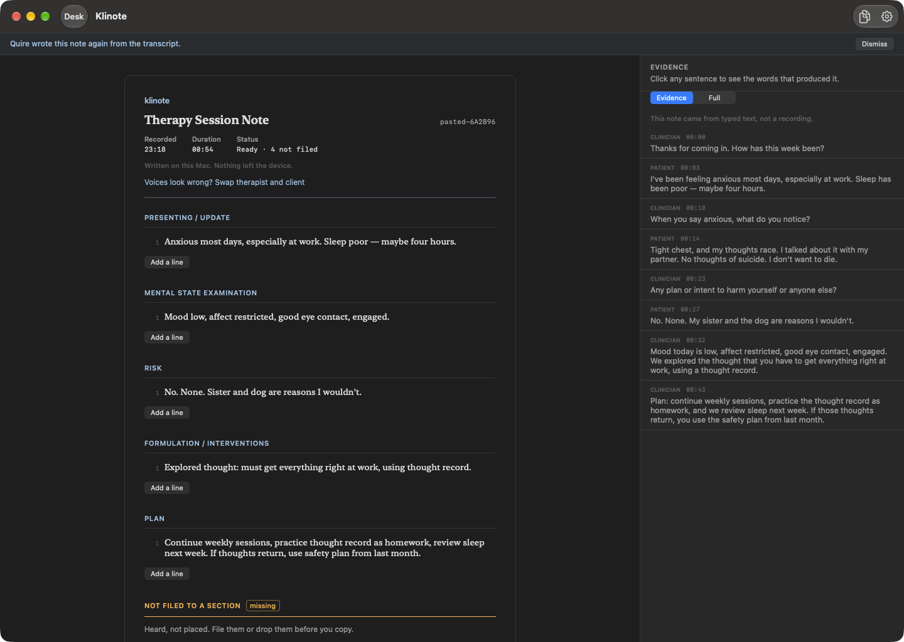
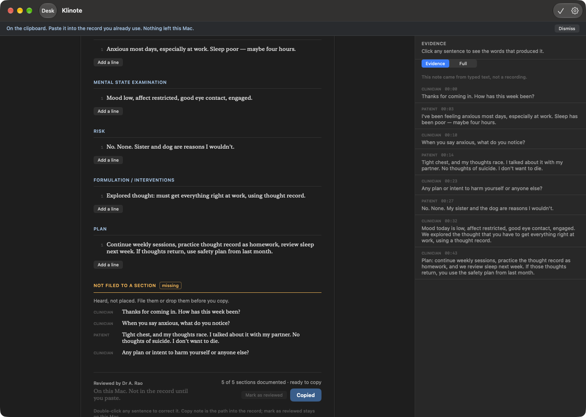

# Klinote

**The session stays in the room. The note still gets written.**

[](https://buymeacoffee.com/amitash)

Klinote is a local-only clinical scribe for macOS, free and open source. It turns a
consultation into a structured note **on the clinician's own Mac**, and links every
sentence in that note back to the words that were actually said. Nothing is uploaded.
There is no account, no per-token bill, and no data-processing agreement, because
there is no data processor.

The interesting part is not that the AI is local. It is that **a note from Klinote can be
audited** — sentence by sentence, against a transcript that never left the machine — and
that the source proving the privacy claim is sitting here, with a CI check that fails the
build if anyone quietly breaks it.

```
 recording ──► SpeechAnalyzer ──► diarisation ──► note engine ──► review ──► clinician
               (system API)       (in scribe-core)  (Quire, or     (evidence   signs.
                no download,                         on-device      margin)    the
                no upload                            Apple model)              machine
                                                                              never does.
```

| | |
|---|---|
| **Platform** | macOS 15+. On-device speech and the Apple note model need macOS 26+. |
| **Stack** | Rust engine (11 crates) + SwiftUI shell, over a hand-written C ABI |
| **Privacy** | Audio and text never leave the Mac. Enforced by a script you can run yourself |
| **Tests** | 98 Rust, 51 Swift, 7 gate checks, green under `./scripts/gate.sh` |
| **Size** | 17 MB app bundle, 6.5 MB archive. The optional note model is a separate 1.9 GB download |
| **Licence** | Apache-2.0 |
| **Status** | A working app. Not a validated product. [See exactly which is which](#what-is-done-and-what-is-not) |

---

## Contents

- [See it](#see-it)
- [The problem it actually solves](#the-problem-it-actually-solves)
- [The promise, and how to check it yourself](#the-promise-and-how-to-check-it-yourself)
- [What a note is, mechanically](#what-a-note-is-mechanically)
- [One example of the standard this holds itself to](#one-example-of-the-standard-this-holds-itself-to)
- [What it is not](#what-it-is-not)
- [Architecture](#architecture)
- [Quickstart](#quickstart)
- [How quality is measured](#how-quality-is-measured)
- [What is done, and what is not](#what-is-done-and-what-is-not)
- [The privacy model](#the-privacy-model)
- [Contributing](#contributing)
- [Support](#support)
- [Documentation](#documentation)

---

## See it

These are the real app, dark appearance, on a **synthetic** session — the bundled
`apps/Klinote/Resources/demo-transcript.txt`, typed in rather than recorded. Not mock-ups,
and not a patient.

### How a session gets in



Recording is not the only door. "Paste what was said" is the concierge path — a transcript
from anywhere becomes a structured note — and it is how the app is tested. The subtitle is
the product in one line: *the next client is soon.*

### The note, and the words behind it



Five sections, filled from what was actually said, beside the margin that can justify each
one. The margin states its own contract: **click any sentence to see the words that produced
it.** The matching phrases are emphasised in the margin rather than in the note, so the
document reads as a document and the evidence stays one click away.

Note what the status says: **Ready · 4 not filed.** Four things the client said did not
belong in any section, and the app says so instead of dropping them.

### The last mile, and what it admits



Copy puts the note on the clipboard and reports it — *paste it into the record you already
use* — because there is no EHR integration and the app does not pretend otherwise. The
completeness check reads **5 of 5 sections documented · ready to copy**, and the unfiled
statements stay on screen with their sources, so the clinician can see exactly what is being
left behind at the moment they paste.

## The problem it actually solves

Ambient AI scribes are good. They are also, for a therapist, a problem that gets worse the
better they work: a recording of the most private hour of someone's week now lives on a
vendor's disk, in another country, reachable by that vendor's staff, under that vendor's
retention schedule. For a solo practice the objection is not theoretical — it is ethics,
sometimes licence conditions, frequently law, and always a conversation the clinician would
rather not have with a client who finds out.

Until recently the local alternative was not good enough to use. That stopped being true.
Apple ships on-device speech recognition and a capable language model as *system APIs*, and
open models run at usable speed on Apple Silicon. So the interesting question moved.

**The model is not the product.** Apple gives you a model for free, and anyone can download
good open weights. What is hard, and what this repository is about, is everything around it:

1. **The template** — the structure a discipline actually documents in.
2. **The routing** — getting the right sentence into the right section.
3. **The completeness check** — telling a clinician what they did *not* say.
4. **The audit trail** — being able to answer "why is this in my note?"
5. **The refusal** — not inventing a feeling, a risk, or a finding the client never named.

Those five are the whole product, and all five are ordinary software you can read.

## The promise, and how to check it yourself

Every privacy claim in this file is mechanically checkable. You do not have to trust a policy
page, and "we take your privacy seriously" is not evidence.

| Claim | Check it yourself |
|---|---|
| The engine cannot make a network request | No HTTP client in any Rust crate, and no dependency that could supply one. A gate step asserts it; run it yourself. |
| The app has exactly one documented outbound path | `scripts/check-network-surface.sh` fails the build if the sandbox grows a second call site. [ADR-0002](docs/engineering/ADR/0002-local-only-privacy-posture.md) explains why it exists and what it fetches. |
| Speech recognition makes no request at all | It is `SpeechAnalyzer`, a system API. There is no model to download for it and no code path from audio to a socket. |
| The store is encrypted, key in the Keychain | `crates/scribe-store` uses SQLCipher; the Swift side only ever holds a Keychain reference. |
| No telemetry, no analytics, no crash reporting | Search for a beacon host or support endpoint. There is none — [and that is a real cost](#what-is-done-and-what-is-not), not a virtue. |
| Nothing is silently dropped from a session | Unroutable statements are listed as *unfiled* rather than discarded. There is a regression test for exactly that. |
| The machine never signs the note | Approval is reachable only from the UI, never from an engine path, and it is recorded in an append-only audit log. |

This is the argument for open-sourcing a clinical tool rather than merely building one:
**for the first time, the claim and the proof can be the same artefact.**

## What a note is, mechanically

A note is not a paragraph. It is sentences, and every sentence carries its own receipts.

```text
Sentence 12.  "Temp 37.4°C, pulse 88 bpm, regular."
  evidence    → segment 41, segment 42   select it and the margin shows only these words
  support     → supported                figures and drug names appear in them
  ambiguous   → false                    exactly one source, so no second reading to check
  wording     → plain                    needs no patient-facing expansion
  authored    → engine                   not typed by a human, and that is recorded too
```

That structure makes four things possible that a wall of generated prose is not.

**Read any claim against its source.** Select a sentence and the evidence margin rewrites
itself to show the utterances that produced it, with the matching phrase emphasised. A
sentence with no receipts is visibly different from a sentence with them.

**Catch the mistake that ends careers.** A figure or drug name in the note that is not in the
words that were heard is flagged *check source*. That is a deterministic check in
[`scribe-core/src/support.rs`](crates/scribe-core/src/support.rs) — no model judgement, no
prompt, nothing to bribe with clever phrasing. It never rewrites the sentence. It is a review
prompt, not an error, and it never blocks a clinician.

**Stop guessing at names.** Recognition manglings of real drugs are collected as *suggestions*
— `terazine → cetirizine` — presented, and applied **only** when the clinician says so.
Nothing is silently corrected inside a medical record.

**Say what is missing.** Required sections the clinician never reached are surfaced as
*missing*, with a count, before the note is ever copied. An empty Assessment is more dangerous
than a wrong one, because a wrong one at least contains a claim somebody could dispute.

Latin shorthand gets the same treatment, with a distinction that matters: `tds` expands to
"three times a day" because it cannot mean anything else, while `od` is **flagged rather than
expanded**, because it can mean *once daily* or *right eye*. Software that resolves that
ambiguity silently is software that has already changed an instruction.

### One example of the standard this holds itself to

The grounding check used to compare numbers as digits. Digits lie in both directions.

- A note writing `q8h` against a transcript saying *"three times a day"* was **flagged** — the
  digit 8 does not appear in the words heard. Same instruction, different notation.
- A note writing `q4h` against *"four times a day"* was **passed** — a 4 appears on both sides.
  But every four hours is **six** doses a day, and four times a day is every six. A real dosing
  discrepancy was sliding through on a coincidence.

Both are fixed by comparing **doses per day** rather than digits, and by reading `qNh` as an
interval instead of a quantity. The first case is now silent. The second is now flagged, which
is not a regression: it is a genuine prescribing error surfacing for the first time.

That is the whole reason for publishing this. A check quietly trusting arithmetic would not
have been noticed by anyone reading a note, and could not have been noticed at all from
outside a closed product.

## What it is not

The boundary is deliberate, and it is governed by
[`PRODUCT-TRUTH.md`](docs/product/PRODUCT-TRUTH.md) — a file that outranks everything this
README is allowed to say. If marketing and that file disagree, marketing is wrong.

- **Not a diagnostician.** It documents a consultation a clinician already conducted. No
  diagnosis, triage, or clinical decision support, and nothing that would make it a regulated
  medical device.
- **Not validated.** No clinical evaluation has been performed. Accuracy has been tested on
  synthetic fixtures, which is a statement about the software, not about patient care.
- **Not "compliant".** A strong privacy posture is not a HIPAA or GDPR determination, and
  nobody has assessed it as one.
- **Not an EHR integration.** There is no Epic button. The last mile is deliberately modest:
  copy, or print, into the record the practice already uses — guarded, because pasting the
  wrong patient's note is the cheapest serious harm available to this product.
- **Not finished.** See [what is done and what is not](#what-is-done-and-what-is-not).

## Architecture

Two halves, and a boundary that exists so the interesting one is testable without a GUI.

```
┌─────────────────────── apps/Klinote · Swift / SwiftUI ────────────────────────┐
│  menu bar · recording strip (NSPanel) · review window · evidence · settings   │
│        │                                                        ▲             │
│        │ C ABI, JSON both ways                                  │ SpeechAnalyzer
│        ▼                                                        │ FoundationModels
│  ┌─────────────────────────────────────────────────────────────┴───────────┐  │
│  │  crates/scribe-ffi — the only door between the two halves               │  │
│  └─────────────────────────────────────────────────────────────────────────┘  │
└───────────────────────────────────────┬───────────────────────────────────────┘
                                        │ static library
┌───────────────────────────────────────▼───────────────────────── Rust ────────┐
│ scribe-core      Transcript · ClinicalNote · grounding check · patient register│
│ scribe-pipeline  the only orchestration path: ASR → diarise → note → verify    │
│ scribe-audio     WAV · mono downmix · energy VAD (300 ms closes a span)        │
│ scribe-diarize   pitch + zero-crossing clustering; deterministic turn fallback │
│ scribe-note      template library · routing · completeness · generation        │
│ scribe-store     SQLCipher · append-only audit log · encrypted search          │
│ scribe-llm       Quire — llama.cpp, isolated as a sibling process              │
│ scribe-asr       the `AsrEngine` trait (macOS recognises in the shell)         │
│ scribe-asr-whisper · scribe-cli · scribe-ffi — offline tools and the boundary  │
└────────────────────────────────────────────────────────────────────────────────┘
```

**The Rust engine contains no networking code at all, and the Swift shell is allowed exactly
one outbound path.** That is the privacy design stated as an architecture constraint rather
than a policy document.

Read the two decisions before disagreeing with them:
[ADR-0001](docs/engineering/ADR/0001-rust-core-swift-shell.md) on why a Rust core sits under a
native shell instead of all-Swift or all-Tauri, and
[ADR-0002](docs/engineering/ADR/0002-local-only-privacy-posture.md) on why a sandboxed app
keeps a network entitlement and how narrowly it is fenced.

**Two note engines, and which one you get.** `Quire` — about 1.9 GB of open weights, fetched
once — is primary, because it is what *polishes* a draft into clinical prose and it is
measured doing that. If it has never been downloaded, the **system's own on-device Apple
model** writes the note with no download at all. Below both, a deterministic rule-based
generator produces a structured, fully-cited note from a transcript with no model present.
Head to head, honestly, in [LLM-BENCH.md](docs/engineering/LLM-BENCH.md).

## Quickstart

Everything below runs locally. No key, no account, and no model is required to start.

```bash
git clone https://github.com/amitashwinibhagat/Klinote.git
cd Klinote

# 1. The whole gate — format, clippy, tests and every guard. CI is configured to run this.
./scripts/gate.sh

# 2. Engine only: transcript file in, structured note out.
cargo run -p scribe-cli -- templates
cargo run -p scribe-cli -- note --transcript fixtures/sample-transcript.txt

# 3. Persist it — encounter, transcript, note and an audit entry, in SQLCipher.
cargo run -p scribe-cli -- note \
  --transcript fixtures/sample-transcript.txt \
  --db ./scribe.db --patient-ref demo-001
```

The macOS app:

```bash
cd apps/Klinote
xcodegen generate          # the project is generated, never committed
xcodebuild -project Klinote.xcodeproj -scheme Klinote -configuration Release \
  -derivedDataPath /tmp/klinote-dd build CODE_SIGNING_ALLOWED=NO
open /tmp/klinote-dd/Build/Products/Release/Klinote.app
```

⌘⇧N opens the review window from the menu bar. Recording is a system-wide hotkey registered
through Carbon — see [`Recording/HotKeys.swift`](apps/Klinote/Sources/Recording/HotKeys.swift)
for current bindings. A release build needs signing rather than an ad-hoc one;
[`scripts/release.sh`](scripts/release.sh) does it properly.

Transcript format is forgiving — role prefixes are optional, timestamps are optional, and an
untagged line continues the previous speaker:

```text
CLINICIAN: Good morning, what brings you in today?
PATIENT: I've had a sore throat for four days.
[00:42] CLINICIAN: Any fever?
wrapped continuation of the same speaker
```

**All fixtures in this repository are synthetic.**
[`fixtures/README.md`](fixtures/README.md) states the rule, and the rule is that no real
patient data is stored here and none may be.

### Two things that will bite you when building

- **After an Xcode upgrade**, `llama-cpp-sys` may fail with `'cstdio' file not found` while
  compiling a header that is plainly present. The CMake cache holds the *previous* SDK path,
  which the upgrade deleted. Clear those build directories; the error names nothing relevant.
- **Unsigned is not a release.** An ad-hoc build runs on the Mac that made it and nowhere
  else, cannot be notarized, and cannot take a secure timestamp. `release.sh` pins the
  Developer ID by team so a stray certificate in the keychain cannot sign a release as the
  wrong legal entity.

## How quality is measured

Benchmarks live in the repo rather than in a blog post, and several of them exist only
because a claim failed to survive one.

| Harness | What it answers |
|---|---|
| [`note-bench`](scripts/note-bench.py) | Does a drafted note have every required section, are its citations real, and does any sentence fail its own grounding check? Headless, no download, and it now grounds the draft exactly as the shipped app does. |
| [`diarize-bench`](scripts/diarize-bench.py) | How often does the diariser attribute a line to the right speaker, on a two-voice consult where the harness already knows who said what? |
| [`engine-compare`](scripts/engine-compare.py) | The same transcript and template through both note engines, and end to end from real audio. |
| [`check-design-tokens.sh`](scripts/check-design-tokens.sh) | Does the interface use only documented colours, type roles and spacing? |
| [`check-network-surface.sh`](scripts/check-network-surface.sh) | Has the app grown a second outbound path? |
| [`check-wired.sh`](scripts/check-wired.sh) | Does every screen still render a live object rather than a placeholder? |

Two of these have already earned their place. The design-token check had been rejecting every
*valid* spacing value and accepting only zero, which meant `gate.sh` was red on `main` and
nobody noticed. The grounding check was flagging correct clinical writing while waving through
an incorrect dose interval.

The discipline behind all of it, and the one rule to keep as a contributor:
**measure before you delete.** One migration in this project's history was built, measured,
and reverted because the numbers said it was worse — and the reverted decision is written down
rather than deleted.

## What is done, and what is not

Deliberately unflattering, because a clinical tool that oversells its own state is worse than
one that does not exist.

**Done and verified**

- Rust engine end to end: templates, generation, routing, completeness, grounding,
  patient-facing register, encrypted store, append-only audit log, CLI, C ABI.
- On-device recognition through `SpeechAnalyzer`. No model to download, no audio upload, and
  **0 whisper symbols in the shipped app binary** — checked on the artefact, not the intent.
- Acoustic speaker clustering with a deterministic turn-gap fallback, and a voice swap that
  re-derives roles from evidence instead of re-recording.
- Two note engines plus a no-model fallback, each producing per-sentence evidence. The
  grounding check now runs on **every** path that writes a note, including one that used to
  skip it entirely.
- Sandboxed, Developer ID signed, hardened runtime, notarized releases, nested executables
  verified. Settings, a patient-facing document mode, print and copy guards.
- 98 Rust and 51 Swift tests behind a 7-check gate, green when you run `./scripts/gate.sh`.

**Not done**

- **No evidence on hand.** No design partner, no pilot clinician, no real encounter
  recordings, no outcomes. Nothing here has been compared against a note a clinician actually
  signed and filed, which is the only comparison that would mean anything.
- **Two similar voices are not separated.** Pitch clustering reports one speaker rather than
  inventing a turn. Fixing it needs speaker embeddings, i.e. a model download — a real
  decision about the posture, not a TODO.
- **No EHR integration. No retention policy. No support path, no crash reporting** — the last
  one by design: with no telemetry, a failure in somebody else's practice reaches you only if
  they write to you.
- **The optional model download is not pinned by checksum.** It arrives over HTTPS from a
  public host and is trusted on transport alone. Verifying a hash before the file is used is a
  small change with a large trust payoff, and it is exactly the kind of thing a closed product
  never has to answer for.
- **Hosted CI has never gone green.** The workflow needs the macOS 26 image, because the app
  compiles Apple's Foundation Models and an older SDK cannot resolve the import. No macOS 26
  runner has picked the job up: one label fails in ten seconds, the explicit `macos-26-arm64`
  label queues until cancelled. So every enforcement claim in this file is about the gate, not
  a badge — which is the better bargain anyway, since the gate runs on your Mac.
- **No clinical validation of any of the five templates.** The structures are implemented and
  editable; whether each is what that discipline documents is for a clinician to judge.

## The privacy model

- **Nothing leaves the Mac.** Audio and text have no upload path, and there is no server in
  this architecture to trust or to subpoena.
- **One download, once, for optional higher quality.** The note model comes over HTTPS from a
  public open-weights host. Without it, the system's own model writes the note. That single
  call site is the entire network surface, isolated in one file that CI watches. It is **not
  pinned by checksum today**, which is a real gap rather than a nuance — see
  [not done](#what-is-done-and-what-is-not), and it is a good first contribution.
- **Pseudonymous by construction.** There is no patient name field anywhere in the product.
  Records key on an opaque `patient_ref`, which is also why the output is a document to be
  pasted into a record rather than a record.
- **Encrypted at rest** with SQLCipher, a per-install key in the Keychain, and a real delete:
  hard `DELETE` then `VACUUM`, so the pages do not linger in the file.
- **Append-only audit log,** so "who approved this, and when" survives every later edit.
- **No telemetry.** Stated as a cost as well as a property.

Full text, including what is *not* claimed: [PRIVACY.md](docs/compliance/PRIVACY.md).

## Contributing

Start with [`AGENTS.md`](AGENTS.md), which is written for humans and for the AI assistants
working in this repository, and encodes the durable rules. Then:

```bash
./scripts/gate.sh     # must be green before any pull request
```

The five rules that matter most:

1. **On-device is the product.** New network use is an architecture decision, not a line of
   code. Expect `check-network-surface.sh` to object.
2. **The engine never blocks a clinician.** It flags, cites and expands. It does not rewrite
   meaning, refuse to produce a note, or approve one.
3. **Measure before you delete,** with a named harness and a reproducible command in the
   commit message. Components were replaced only after a bench said they could be.
4. **No real patient data, ever** — not in fixtures, tests, screenshots or logs.
5. **`PRODUCT-TRUTH.md` outranks marketing,** including this README.

The two most valuable contributions available right now are both in the list above: speaker
separation that does not require a download, and a harness that scores a generated note
against a clinician-signed one. The second one is the difference between a project with good
engineering and a product anyone can believe.

## Support

Klinote is free and Apache-2.0, with no paid tier behind it — the software is never
the thing you pay for, and the licence already grants you every feature.

The work that most needs doing — scoring a draft against a note a clinician actually
signed, and separating two voices that sound alike — is the work nobody is paying
for.

There is no subscription, and there will not be one until validation says the draft is
worth standing behind. What exists instead:

- **Shape it for your discipline** — free, three to five practices. You get the template
  build free, tuned to how your practice actually documents, and in exchange you report
  honestly on the draft: what it invented, what it misfiled, whether reviewing it took
  longer than typing it. Nobody pays. See
  [docs/product/MONETISATION.md](docs/product/MONETISATION.md) for why charging for
  validation was rejected.
- **A bespoke template build** — from $600, one-off. If your practice's notes do not
  fit a built-in shape, the template is written and tuned to how your clinicians
  actually document, tested against signed notes, and handed back as a file you own.
  It is template work: it buys no promise about transcription accuracy, compliance or
time saved, because none of those are measured yet.

The practice tier — tuned templates, priority triage and a named person accountable,
priced per practice rather than per clinician — arrives when the cohort gives the
green light, and not before.

If it earned you an evening and you want nothing in return, you can [buy me a
coffee](https://buymeacoffee.com/amitash). It buys no features and no support
promise.

[](https://buymeacoffee.com/amitash)

## Documentation

| Read | When |
|---|---|
| [PRODUCT.md](PRODUCT.md) | What the product is, who for, and what may be claimed |
| [PRODUCT-TRUTH.md](docs/product/PRODUCT-TRUTH.md) | The claim policy. Governs this README |
| [DESIGN.md](DESIGN.md) | The visual system: colours, named type roles, spacing, motion |
| [ARCHITECTURE.md](docs/engineering/ARCHITECTURE.md) | The map, and who writes the note |
| [ADR-0001](docs/engineering/ADR/0001-rust-core-swift-shell.md) | Why a Rust core under a native shell |
| [ADR-0002](docs/engineering/ADR/0002-local-only-privacy-posture.md) | The network exception, and why it stays narrow |
| [ASR.md](docs/engineering/ASR.md) | Recognition and diarisation, and what each is not |
| [LLM-BENCH.md](docs/engineering/LLM-BENCH.md) | How note quality is measured, engine comparison |
| [RELEASING.md](docs/engineering/RELEASING.md) | Signing, notarization, nested-executable traps |
| [ROADMAP.md](docs/product/ROADMAP.md) | What is next, and the criterion for stopping |
| [UX-PLAN.md](docs/design/UX-PLAN.md) · [SCREENS.md](docs/design/SCREENS.md) | The design system and every state |

## Licence

Apache License 2.0 — see [LICENSE](LICENSE) and [NOTICE](NOTICE).

You may use, modify, distribute and sell this software. Attribution and stating changes are
requested. The patent grant in §3 is why Apache rather than MIT was chosen for software that
ends up inside a clinical workflow.

If you build something with this — especially something you would trust with a session —
please say so. A tool that documents private conversations is the kind of software that gets
better by being argued with, and the parts most worth arguing about are the ones that decide
whether a sentence belongs in a medical record.
